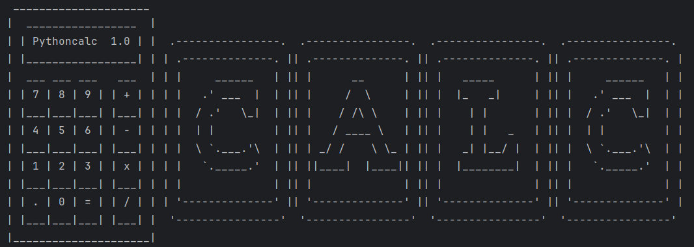

# Calculadora Básica

Essa calculadora foi desenvolvida como meio de aprendizado. No momento ela possui funções como:

* Multiplicação

* Divisão

* Soma

* Subtração

* Continuar cálculo utilizando o resultado

* Iniciar novo cálculo do zero

Futuramente pretendo incrementar mais funcionalidades como porcentagem, exponenciação, seno, cosseno, tangente, dentre outras.

